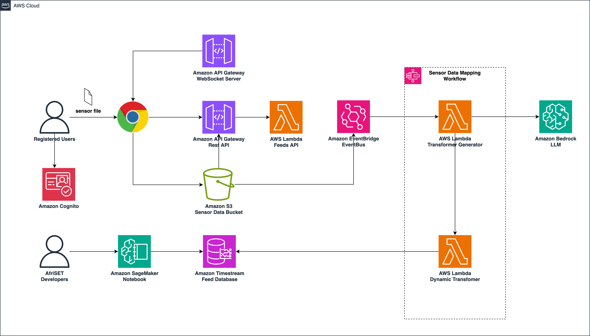

# The Air Quality Sensor Evaluation and Training Centre for West Africa (Afri-SET) Hackaton


## Introduction

This is the solution created as part of `Hack to the rescue`'s hackaton.

*Afri-SET*, dedicated to enhancing air quality monitoring in West Africa, seeks a tech solution to create a universal database for diverse low-cost sensor data. The challenge involves developing an algorithm to standardize outputs from 45
sensors by different manufacturers, ensuring accurate data transmission and correction for environmental factors.

## High Level Architecture

The solution allows user to upload sensor data to a web application that will invoke a pipeline that uses AWS Bedrock LLM to map the input data into a common schema format and stores it into AWS Timestream time series database.



## Create ECR repository

Run the command below to create the ECR repository in your AWS account.

```shell
$ aws ecr create-repository --repository-name afri-set-transformer --image-scanning-configuration scanOnPush=true -r <REGION>
```

## Building the Transformer Docker Images

Run the command below to build the docker image for the transformer container.

```shell
$ cd python/transformerGenerator
$ ./build.bash -r <REGION> -a <ACCOUNT_ID>
```

## Deploying the infrastructure

Use CDK to deploy the rest of the infrastructure.

```shell
$ npm run cdk -- synth -c environment= administratorEmail= never --all <ENVIRONMENT >-c <ADMINISTRATOR_EMAIL >--require-approval
```
